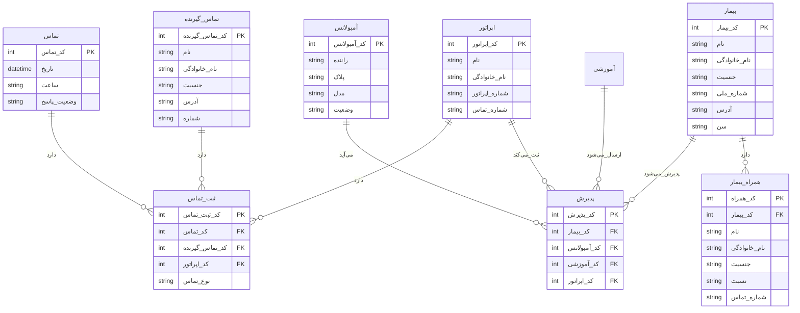

```mermaid
erDiagram

    تماس {
        int کد_تماس PK
        datetime تاریخ
        string ساعت
        string وضعیت_پاسخ
    }

    تماس_گیرنده {
        int کد_تماس_گیرنده PK
        string نام
        string نام_خانوادگی
        string جنسیت
        string آدرس
        string شماره
    }

    ثبت_تماس {
        int کد_ثبت_تماس PK
        int کد_تماس FK
        int کد_تماس_گیرنده FK
        int کد_اپراتور FK
        string نوع_تماس
    }

    اپراتور {
        int کد_اپراتور PK
        string نام
        string نام_خانوادگی
        string شماره_اپراتور
        string شماره_تماس
    }

    آمبولانس {
        int کد_آمبولانس PK
        string راننده
        string پلاک
        string مدل
        string وضعیت
    }

    بیمار {
        int کد_بیمار PK
        string نام
        string نام_خانوادگی
        string جنسیت
        string شماره_ملی
        string آدرس
        string سن
    }

    پذیرش {
        int کد_پذیرش PK
        int کد_بیمار FK
        int کد_آمبولانس FK
        int کد_آموزشی FK
        int کد_اپراتور FK
    }

    همراه_بیمار {
        int کد_همراه PK
        int کد_بیمار FK
        string نام
        string نام_خانوادگی
        string جنسیت
        string نسبت
        string شماره_تماس
    }

    تماس ||--o{ ثبت_تماس : دارد
    تماس_گیرنده ||--o{ ثبت_تماس : دارد
    اپراتور ||--o{ ثبت_تماس : دارد
    آمبولانس ||--o{ پذیرش : می‌آید
    بیمار ||--o{ پذیرش : پذیرش_می‌شود
    آموزشی ||--o{ پذیرش : ارسال_می‌شود
    اپراتور ||--o{ پذیرش : ثبت_می‌کند
    بیمار ||--o{ همراه_بیمار : دارد
```
